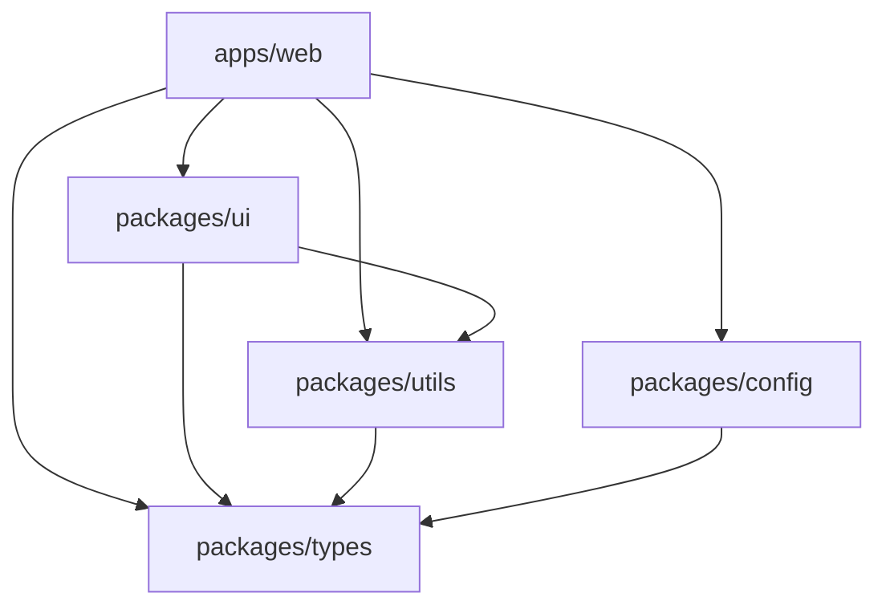
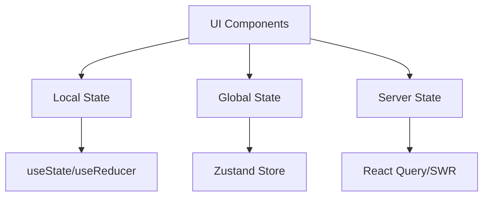
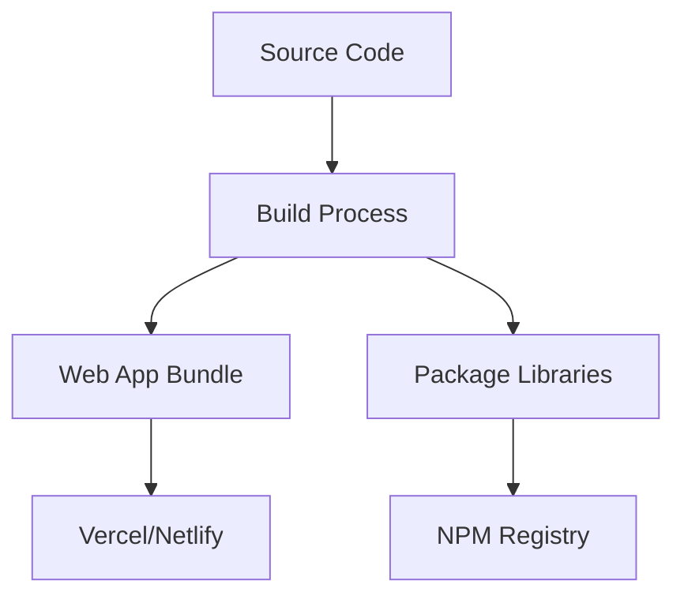
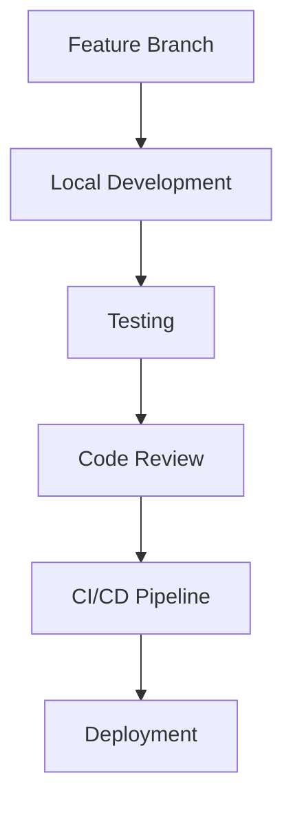

# Architecture Overview

This document provides a comprehensive overview of the monorepo architecture, design decisions, and patterns used throughout the project.

## 🏗️ High-Level Architecture

### Monorepo Structure

The project follows a workspace-based monorepo architecture with clear separation of concerns:

```
react-monorepo/
├── apps/                    # Applications (frontends)
├── packages/               # Shared libraries
├── .github/                # CI/CD workflows
├── .vscode/                # Development environment
└── docs/                   # Documentation
```

### Design Principles

1. **Separation of Concerns**: Each package has a single, well-defined responsibility
2. **Dependency Direction**: Dependencies flow from apps → packages, never the reverse
3. **Type Safety**: End-to-end TypeScript coverage with shared type definitions
4. **Developer Experience**: Optimized tooling for fast development cycles
5. **Scalability**: Architecture supports adding new apps and packages easily

## 📦 Package Architecture

### Package Dependencies



### Package Responsibilities

#### @company/types
- **Purpose**: Shared TypeScript type definitions
- **Scope**: API interfaces, entity types, utility types
- **Dependencies**: None (pure types)
- **Consumers**: All other packages and apps

#### @company/config
- **Purpose**: Shared configuration and constants
- **Scope**: Environment configs, feature flags, API endpoints
- **Dependencies**: @company/types
- **Consumers**: All apps and some packages

#### @company/utils
- **Purpose**: Pure utility functions
- **Scope**: Formatting, validation, HTTP clients, storage
- **Dependencies**: @company/types, external libraries
- **Consumers**: All apps and @company/ui

#### @company/ui
- **Purpose**: Reusable UI component library
- **Scope**: React components, design system
- **Dependencies**: @company/types, @company/utils, Radix UI, Tailwind
- **Consumers**: All apps

## 🎨 Design System Architecture

### Component Hierarchy

```
Design System
├── Design Tokens (CSS Variables)
├── Base Components (Button, Card, etc.)
├── Composite Components (Forms, Tables, etc.)
└── Layout Components (Container, Grid, etc.)
```

### Styling Strategy

1. **CSS Variables**: Design tokens for consistent theming
2. **Tailwind CSS**: Utility-first CSS framework
3. **Component Variants**: CVA (Class Variance Authority) for type-safe variants
4. **Compound Components**: Related components grouped together

### Component Patterns

```tsx
// Base component pattern
const ComponentVariants = cva(baseClasses, {
  variants: { /* ... */ },
  defaultVariants: { /* ... */ }
});

interface ComponentProps extends 
  HTMLAttributes<HTMLElement>,
  VariantProps<typeof ComponentVariants> {}

const Component = forwardRef<HTMLElement, ComponentProps>(
  ({ className, variant, ...props }, ref) => (
    <element
      className={cn(ComponentVariants({ variant, className }))}
      ref={ref}
      {...props}
    />
  )
);
```

## 🔧 Build System Architecture

### Turbo Pipeline

```json
{
  "pipeline": {
    "build": {
      "dependsOn": ["^build"],
      "outputs": ["dist/**", ".next/**"]
    },
    "dev": {
      "cache": false,
      "persistent": true
    },
    "lint": {
      "dependsOn": ["^lint"]
    }
  }
}
```

### Build Process

1. **Type Generation**: TypeScript compiles types first
2. **Package Building**: Shared packages built in dependency order
3. **App Building**: Applications built after all dependencies
4. **Caching**: Turbo caches build outputs for speed

### Bundle Strategy

- **Packages**: Multiple formats (CJS, ESM) for compatibility
- **Apps**: Optimized bundles with code splitting
- **Shared Chunks**: Common dependencies extracted
- **Tree Shaking**: Unused code eliminated

## 📡 Data Flow Architecture

### State Management



### Data Patterns

1. **Local State**: Component-specific state with React hooks
2. **Global State**: Application-wide state with Zustand
3. **Server State**: API data caching with React Query
4. **Form State**: Form management with React Hook Form

### API Integration

```tsx
// API client pattern
const apiClient = createApiClient(config.api.baseUrl);

// Type-safe API calls
const useUsers = () => {
  return useQuery<ApiResponse<User[]>>({
    queryKey: ['users'],
    queryFn: () => apiClient.get<User[]>('/users')
  });
};
```

## 🔐 Type Safety Architecture

### Type Flow

```
Database Schema → API Types → Shared Types → Component Props
```

### Type Strategies

1. **Shared Types**: Common interfaces in @company/types
2. **API Types**: Request/response interfaces
3. **Component Types**: Props and state interfaces
4. **Utility Types**: Generic type helpers

### Type Safety Patterns

```tsx
// Generic API response
interface ApiResponse<T> {
  data: T;
  success: boolean;
  message?: string;
}

// Type-safe form handling
const FormSchema = z.object({
  email: z.string().email(),
  password: z.string().min(8)
});

type FormData = z.infer<typeof FormSchema>;
```

## 🧪 Testing Architecture

### Testing Strategy

```
Unit Tests → Integration Tests → E2E Tests
```

### Test Patterns

1. **Unit Tests**: Individual functions and components
2. **Integration Tests**: Component interactions
3. **E2E Tests**: Full user workflows
4. **Visual Tests**: Component visual regression

### Testing Structure

```
src/
├── components/
│   ├── Button.tsx
│   └── __tests__/
│       ├── Button.test.tsx
│       └── Button.stories.tsx
└── utils/
    ├── formatting.ts
    └── __tests__/
        └── formatting.test.ts
```

## 🚀 Deployment Architecture

### Build Targets



### Deployment Strategies

1. **Apps**: Static deployment on CDN (Vercel, Netlify)
2. **Packages**: Published to NPM registry (private/public)
3. **Documentation**: Static site deployment
4. **Storybook**: Component documentation hosting

## 📊 Performance Architecture

### Optimization Strategies

1. **Bundle Splitting**: Separate vendor and app code
2. **Lazy Loading**: Route-based code splitting
3. **Tree Shaking**: Remove unused code
4. **Caching**: Build and runtime caching
5. **CDN**: Static asset delivery

### Performance Patterns

```tsx
// Code splitting
const LazyComponent = lazy(() => import('./Component'));

// Memoization
const MemoizedComponent = memo(Component);

// Virtual scrolling for large lists
const VirtualList = ({ items }) => (
  <FixedSizeList
    height={600}
    itemCount={items.length}
    itemSize={50}
  >
    {Row}
  </FixedSizeList>
);
```

## 🔄 Development Workflow

### Development Cycle



### Workflow Automation

1. **Pre-commit Hooks**: Linting and formatting
2. **CI Pipeline**: Testing and building
3. **CD Pipeline**: Automated deployment
4. **Code Quality**: Automated checks and reports

## 🛡️ Security Architecture

### Security Considerations

1. **Type Safety**: Prevents runtime errors
2. **Input Validation**: Zod schema validation
3. **Environment Variables**: Secure configuration
4. **Dependencies**: Regular security updates
5. **Access Control**: Role-based permissions

### Security Patterns

```tsx
// Input validation
const UserSchema = z.object({
  email: z.string().email(),
  password: z.string().min(8)
});

// Environment validation
const requiredEnvVars = [
  'NEXT_PUBLIC_API_URL',
  'DATABASE_URL'
];

requiredEnvVars.forEach(varName => {
  if (!process.env[varName]) {
    throw new Error(`Missing required environment variable: ${varName}`);
  }
});
```

## 📈 Scalability Considerations

### Horizontal Scaling

1. **Micro-frontends**: Split large apps into smaller ones
2. **Package Granularity**: Split large packages when needed
3. **Team Boundaries**: Align packages with team ownership
4. **API Gateway**: Centralized API management

### Vertical Scaling

1. **Performance Optimization**: Bundle size, lazy loading
2. **Caching Strategies**: Build and runtime caching
3. **CDN Integration**: Global content delivery
4. **Database Optimization**: Query optimization

## 🔧 Migration Strategies

### Adding New Technology

1. **Gradual Adoption**: Introduce in new packages first
2. **Compatibility Layer**: Maintain backward compatibility
3. **Migration Path**: Clear upgrade path for consumers
4. **Documentation**: Update architecture docs

### Legacy Integration

1. **Wrapper Components**: Wrap legacy components
2. **Progressive Enhancement**: Gradually replace old code
3. **Parallel Development**: New and old systems coexist
4. **Feature Flags**: Control rollout of new features

---

This architecture provides a solid foundation for scalable, maintainable enterprise applications while maintaining developer productivity and code quality.